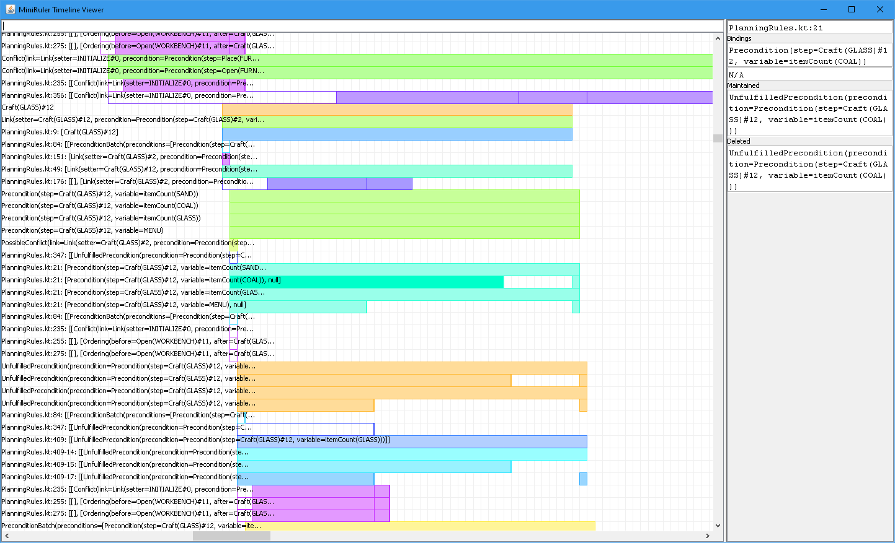

**I am no longer working on MiniRuler, and the `master` branch only runs the unfinished rule-based planner. If you want to see MiniRuler actually playing the game, checkout the `stable` branch.**

MiniRuler is a rule-based AI that plays the top-down survival game [Minicraft](https://en.wikipedia.org/wiki/Minicraft).
It doesn't use any fancy machine learning, but rather features a large number of
hard-coded game-specific rules that tell the agent how to respond to changes in
the environment. This project was mainly intended to teach myself about rule-based
AI, and the pros and cons of this type of programming. MiniRuler is not complete,
and only plays the game up to the point of crafting some tools and avoiding monsters, however it has given me valuable insights into the potential power of rule-based programming.

## Running the Software

MiniRuler is built using Gradle. You can run various parts of the project as follows:
* To run Minicraft by itself, use `./gradlew game:run`
* To run the MiniRuler AI, use `./gradlew main:run`
* To run the timeline viewer, use `./gradlew viewer:run`

## The Rule Engine

MiniRuler's rule engine is a vital component of the system, which allows the definition of rules that fire when there are facts in the global fact base which match the conditions of the rule, usually adding more facts to the fact base. These rules are written in a pure-Kotlin DSL, with syntax similar to the example below:

```kotlin
// Give a new robot to all children who don't already have a toy.
rule {
    val child by find<Person> { age < 10 }
    not<Ownership> { owner == child && item is Toy }

    fire {
        val toy = RobotToy()
        insert(toy)
        insert(Ownership(child, toy))
    }
}
```

These rules are written in pure Kotlin, with the help of concise custom syntax enabled by Kotlin's elegant language features. This means that unlike other rule engines that employ a completely separate custom DSL, you can easily integrate rules into normal code files and interoperate with imperative code. All your IDE's fancy code inspection features will work out the box too!

MiniRuler's rule engine conceptually fires many rules in parallel, so with continued optimizations it could become a highly performant way to execute complex AI software. The unstructured nature of a rule-based program makes it easy to define a large number of loosely related behaviours that share data, without struggling with constant restructuring as the program grows.

## Timeline Debugging

Once a rule base grows large, keeping track of everything that's going on can be a challenge! That's why I created the timeline debugging system, which allows all the rule firings and fact updates that take place during MiniRuler's execution to be written to a file and viewed later in the timeline viewer.



The timeline viewer allows you to visually analyze what happened during the execution of the program, and follow the links between rules and facts. This gives you a crystal-clear view of absolutely everything that happened during execution without the need to step through with a debugger, which is something not many languages can do! I found that using the timeline viewer allowed me to fix bugs substantially faster.

Holding the left mouse button and dragging on the timeline area pans the view, while right-dragging zooms in and out along both axes. Double-clicking a rule or fact in the info pane will select it in the timeline.

## Rule-Based Partial-Order Planning

Before ceasing development of MiniRuler, I was working on a rule-based partial-order planner, which hoped to vastly improve run times on the increasingly large action spaces employed by MiniRuler. The planner uses domain-specific rules to add new steps and links to the plan, which the traditional approach to partial-order planning would usually achieve with an expensive uninformed backtracking search. The eventual idea was that a future learning-enabled system might be able to learn these rules from experience, allowing vastly improved planning performance over uninformed searches. Unfortunately this planner remains unfinished, so the stable version of MiniRuler relies on a simple Dijkstra's search to find low-cost plans.

## Acknowledgements

MiniRuler includes a modified version of the source code of [Minicraft](https://en.wikipedia.org/wiki/Minicraft), created by Markus Persson.